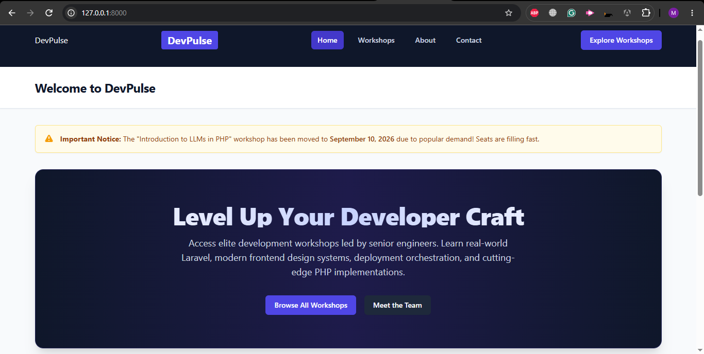
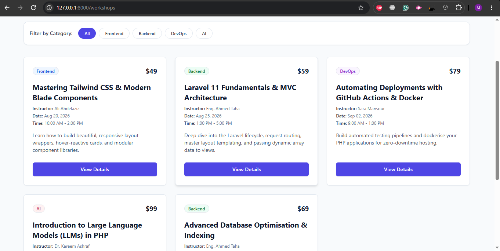
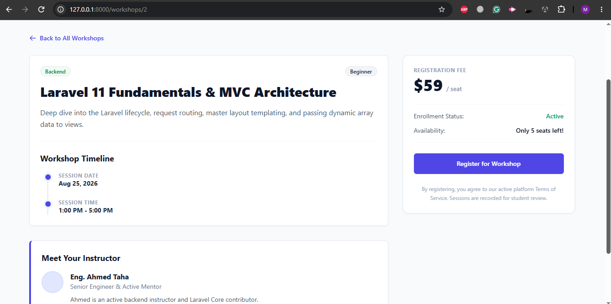
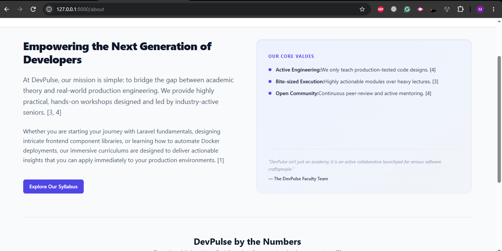
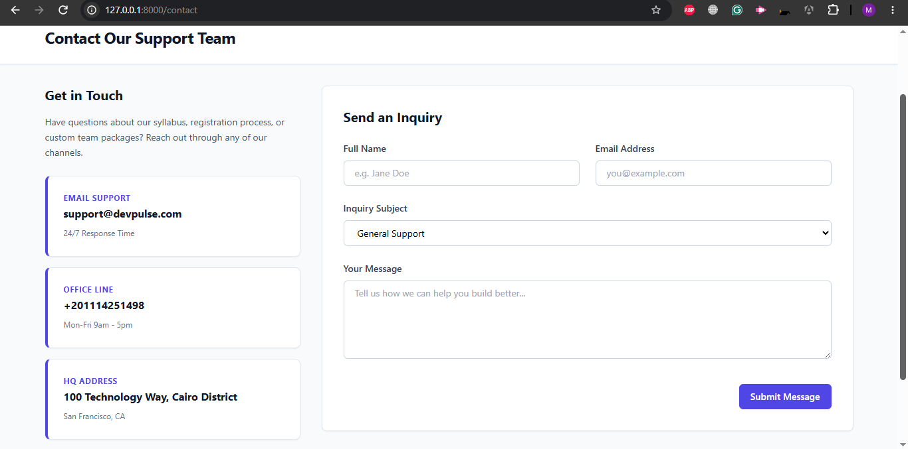
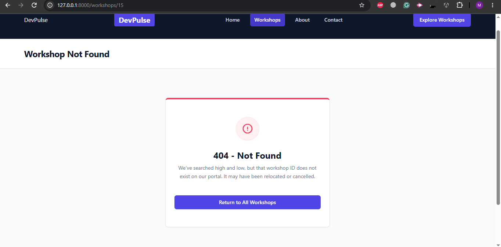

# DevPulse Developer Portal

A modern, responsive multi-page developer workshop and tech community platform built using **Laravel 11, Blade Component Architecture, and Tailwind CSS**. This project serves as a dynamic, front-end only application utilizing hardcoded array datasets inside the routing layer [168, 174, 175].

---

## 🚀 Architectural Implementation & Core Concepts

### 1. Master Layout System (`layout.blade.php`)
The backbone of the application's layout is defined in `resources/views/components/layout.blade.php` [175]. This master template contains:
*   A responsive dark-slate navigation header (`bg-slate-900`) decorated with indigo highlights (`bg-indigo-600`) [172, 175].
*   A default dynamic slot (`{{ $slot }}`) placeholder to inject unique page-specific views [169, 175].
*   A named slot (`{{ $heading ?? 'DevPulse Portal' }}`) to dynamically change title headers in a centralized banner [169, 175].
*   A structured site-wide dark footer (`bg-slate-900` / `text-slate-400`) [169, 172, 175].

### 2. Reusable UI Components
To maximize modularity, four custom sub-components were engineered within the `resources/views/components/` directory [170]:
*   **`<x-nav-link>`**: Dynamically resolves the active navigation class states using Laravel's `request()->is()` helper [170, 179]. It automatically transitions colors and flags `aria-current="page"` when the active path matches the link.
*   **`<x-card>`**: A hover-reactive content wrapper applying clean light-slate boundaries and custom padding transitions (`shadow-sm hover:shadow-md`) [170, 176].
*   **`<x-badge>`**: A category mapping pill rendering tailored tinted backgrounds and text states based on category props (`Frontend`, `Backend`, `DevOps`, `AI`) [170, 176].
*   **`<x-button>`**: A polymorphic button rendering as an anchor (`<a>`) if an `href` attribute is provided, otherwise falling back to a standard `<button>` element [170, 176].

---

## 🚦 Routing & Mock Database Logic (`routes/web.php`)
The routing tier defines five main page endpoints and handles data filtering through an array mock "database" inside `routes/web.php` [171, 175, 176]:
1.  **Home (`/`)**: Gathers the first three featured workshops from the array and mounts an alert announcement banner [171, 176, 177].
2.  **Workshops List (`/workshops`)**: Lists all workshops dynamically. Implements **Category Filtering (Bonus Challenge #3)** via query string filters (e.g., `/workshops?category=Backend`) [171, 178].
3.  **Single Workshop (`/workshops/{id}`)**: Leverages `Arr::first()` to perform lookups against the mock array. Implements a **Custom 404 Graceful Fallback (Bonus Challenge #1)** if the ID cannot be found [171, 173, 177].
4.  **About (`/about`)**: Feeds community statistics into an immersive statistics matrix [171, 177].
5.  **Contact (`/contact`)**: Mounts static contact methods alongside a stylized, interactive inquiry form [171, 178].

---

## 🛠️ Completed Bonus Challenges (+15 Points)

*   **Bonus Challenge #1 (+5 Pts) - Custom 404 Page**: Handled gracefully at `resources/views/errors/404.blade.php` with an animated, styled error panel instead of an unstyled system dump [173, 178].
*   **Bonus Challenge #2 (+5 Pts) - Announcement Alert**: A dynamic notification banner component (`<x-alert>`) that supports multiple warning/info types with corresponding SVG indicators [173, 178].
*   **Bonus Challenge #3 (+5 Pts) - Query Filter Support**: Integrated query filtering on the Workshops page using conditional PHP arrays (`request('category')`) [173, 178].

---

## 💻 Local Setup & Installation

1.  **Clone the Repository**:
    ```bash
    git clone https://github.com/YOUR_GITHUB_USERNAME/devpulse-portal.git
    cd devpulse-portal
    ```
2.  **Install Composer Dependencies** [411]:
    ```bash
    composer install
    ```
3.  **Generate Application Key** [412, 457]:
    ```bash
    php artisan key:generate
    ```
4.  **Run Development Server** [426]:
    ```bash
    php artisan serve
    ```
5.  **Visit in Browser**: Open [http://127.0.0.1:8000](http://127.0.0.1:8000) [426]

---

## 📸 Portal Screenshots

To demonstrate visual fidelity and complete coverage of the project scenario, screenshots for each of the 5 implemented pages are linked below:

### 1. Home Page View
*(Featuring modern Tailwind Hero Section, dynamic `<x-alert>` announcement banner, and top-3 upcoming featured workshops grid)*


### 2. Workshops Listing Page View
*(Featuring active query parameter filter buttons and dynamic grid-reactive hover cards)*


### 3. Single Workshop Details Page View
*(Featuring schedule timeline, dynamic instructor initials avatar, and sticky registration CTA panel)*
 

### 4. About Platform Page View
*(Featuring dynamic metric counter grids and split platform value layouts)*


### 5. Contact Page View
*(Featuring interactive contact inquiry form controls and support desk metadata cards)*


### [Bonus] Custom 404 Not Found Page View
*(Graceful error fallback card displayed when visiting non-existent workshop IDs)*


---

## 🗂️ Clean Atomic Commit Log Summary
This project's git history was maintained using professional conventional committing standards:
1.  `chore: initial laravel installation` — Clean installation of base Laravel project.
2.  `feat: implement master layout template with base slot architecture` — Structured default slot and dynamic title slots.
3.  `feat: implement reusable nav-link component with active state` — High-contrast active class transitions.
4.  `feat: create hover-reactive card container component` — Transitioning cards with merged attribute lists.
5.  `feat: create dynamic category badge component` — Tinted badges for DevOps, AI, Frontend, Backend categories.
6.  `feat: build polymorphic button and anchor CTA component` — Element selector with primary Tailwind styling.
7.  `refactor: integrate dynamic sub-components into master layout` — Replaced static menus in header wrapper.
8.  `feat: implement 5 core routes with robust mock dataset` — Arr::first lookup and query param filters in routes/web.php.
9.  `feat: build reusable alert component for home announcements` — Announcement alerts with warning SVGs (Bonus 2).
10. `feat: implement home view with hero banner and workshop highlights` — Home view with active alerts and featured list.
11. `feat: implement workshops list view with query filtering` — Workshops view with category filter query bar (Bonus 3).
12. `feat: implement single workshop detail view with dynamic timeline` — Workshop info with timeline details.
13. `feat: implement customized 404 error page layout` — Error fallback mapping view (Bonus 1).
14. `feat: implement about view with narrative and stats grid` — Static metrics visual layout.
15. `feat: implement contact view with interactive form and support grid` — Complete contact form layout and contact cards.
